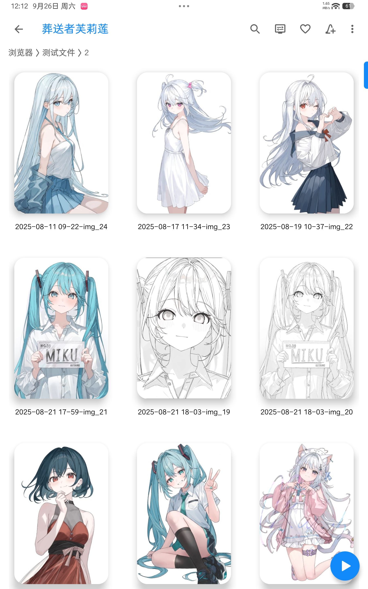
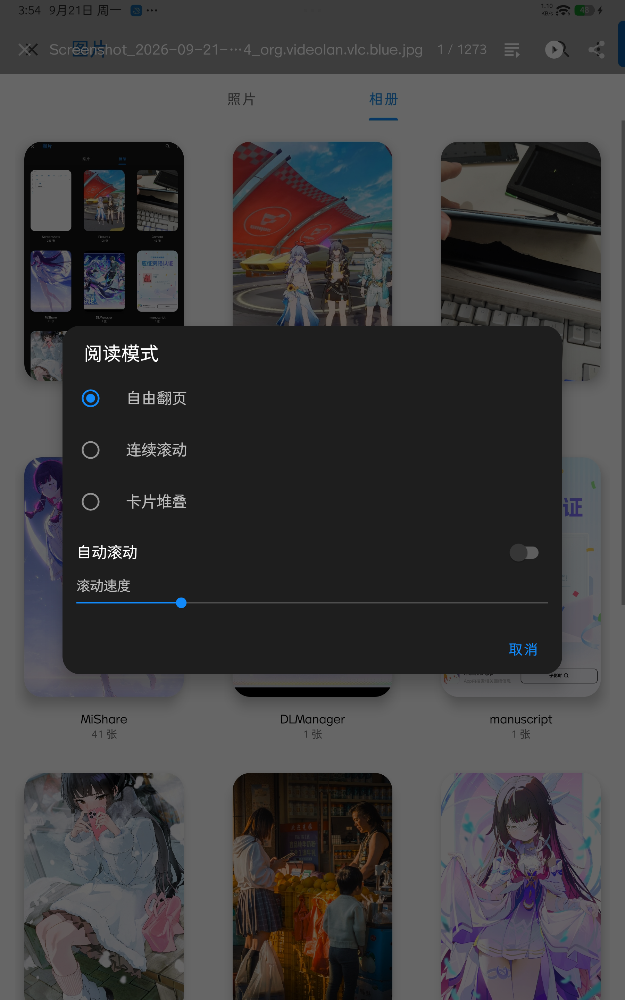
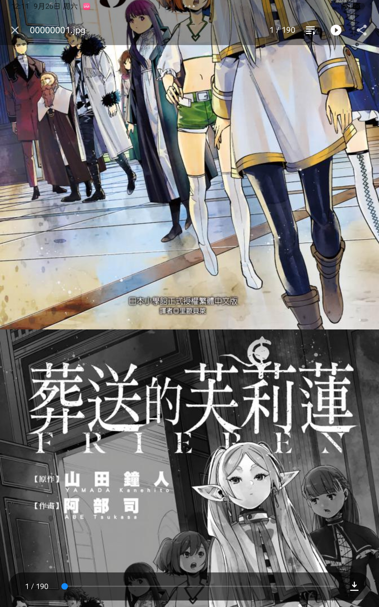

# VLC Blue

**VLC Blue** 是基于 [VLC for Android 3.7.2](https://code.videolan.org/videolan/vlc-android) 的第三方**图片浏览增强 mod**——不是官方 VLC 客户端。它把 VLC 的媒体引擎改造成以图片为中心的浏览体验:大卡片缩略图网格、三种阅读模式、SMB 网络相册、Android TV 支持,全套主题蓝配色。

- 应用名 **VLC Blue**(imageMod flavor),包名 `org.videolan.vlc.blue`,**可与官方 VLC 并存安装**
- 许可证 **GPL-2.0-or-later**,与上游一致
- 适用:手机 / 平板 / Android TV

---

## 特性

### 大卡片缩略图网格

- 20dp 大圆角 + 悬浮阴影、无边框的 2:3 封面卡片,文件名分离在卡片下方居中展示
- 列数自适应:手机竖屏 3 列,平板 / 宽屏自动加列
- 磁盘 + 内存两级缩略图缓存,带负缓存与失败退避:上千张图的目录滚动依旧流畅,断网秒失败不卡线程
- 溢出菜单提供「刷新缩略图」手动重建缓存



### 三种阅读模式,随时切换

点击任意图片进入全屏阅读器,三种模式在工具栏随时切换:切换时保持当前图片,选择自动记忆。

| 模式 | 体验 |
|---|---|
| **自由翻页** | 上下左右四向滑动切图,跟手拖动 + 微缩放 + 淡入景深动效,翻页流畅 |
| **连续滚动** | webtoon 式长卷:整个文件夹的图片无缝拼成一条,一路滚到底;支持**自动平滑滚动**(悬浮按钮启停、触摸自动暂停、1–10 级调速、滚到底自动停止) |
| **卡片堆叠** | 纵深式层叠卡片:下一张常驻顶牌下方,横向划走即翻页,动效轻快 |



阅读器通用能力:双击缩放(1x ↔ 2.5x)、双指捏合(1x–5x,连续滚动下缩放整条长卷)、放大后拖动、单击显示 / 隐藏工具栏、分享当前图片。



### 本地与网络相册

- **本地图片**:MediaStore 全量扫描,按时间倒序,「照片 / 相册」两视图
- **SMB 局域网**:目录与封面缩略图全支持,视频封面带时长角标;主机级失败黑名单(5 分钟 TTL)+ 收紧的超时快速失败,切换网络自动恢复,不可达主机不再拖慢加载
- **系统级打开**:注册了 `image/*` 的打开方式,在任何文件管理器里点图片都能选 VLC Blue

### Android TV

- TV 界面支持图片网格浏览:D-pad 导航、SMB 目录浏览与缩略图渲染,与手机端同一套缓存体系

### 主题配色

- 全套 Material Blue(主色 `#128AFA`):图标、启动器图标、进度条、弹窗亮 / 暗双变体全部跟随,与官方橙色版一眼区分

## 安装

从 [Releases](https://github.com/atriatri20/VLC-Blue/releases) 下载 APK 侧载安装,或:

```bash
adb install -r VLC-Blue-x.y.z.apk
```

## 从源码构建

需要 JDK 17 与 Android SDK。应用构建前需先按[上游文档](https://code.videolan.org/videolan/vlc-android)编译或获取 LibVLC(`libvlc.aar`):

```bash
git clone https://github.com/atriatri20/VLC-Blue.git
cd VLC-Blue
./gradlew :application:app:assembleImageMod
```

发布签名配置不进仓库:在 `~/.gradle/gradle.properties` 中配置 `keyStoreFile` / `storealias` / `storepwd`(见本仓库 `gradle.properties` 内注释)。

## 关于上游

本项目 fork 自 [VideoLAN / vlc-android](https://code.videolan.org/videolan/vlc-android)(GPL-2.0-or-later),在此感谢 VideoLAN 团队。上游的英文说明与完整的 LibVLC 编译文档见[上游仓库](https://code.videolan.org/videolan/vlc-android);本仓库的全部修改同样以 GPL-2.0-or-later 发布。
